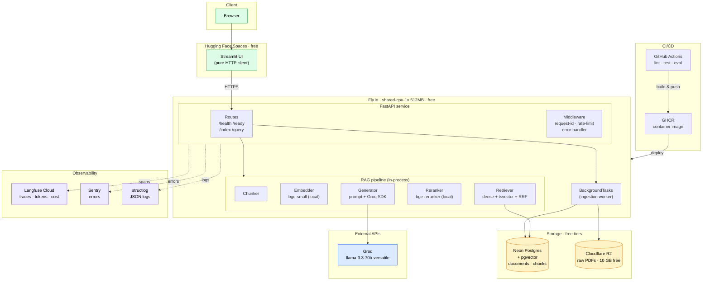
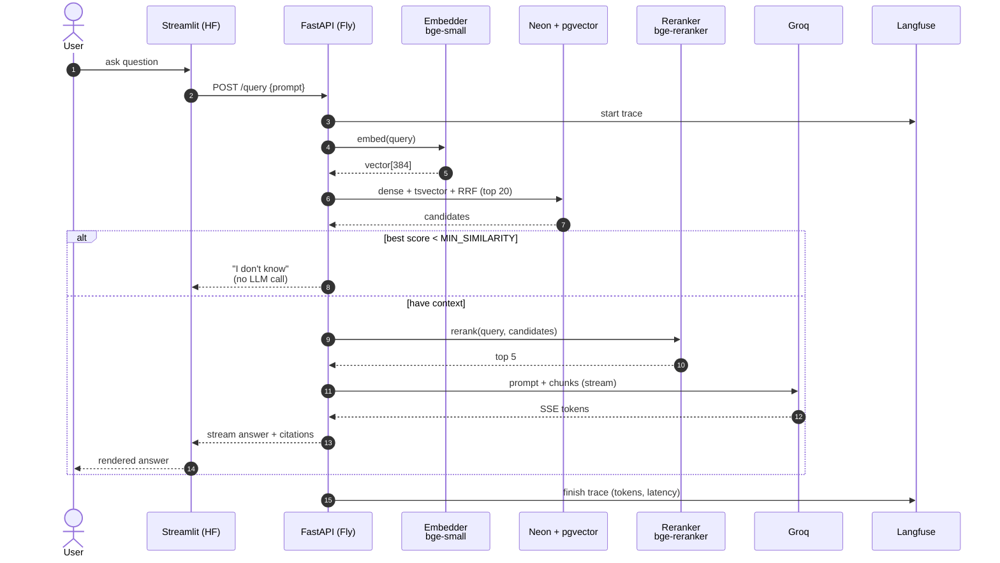
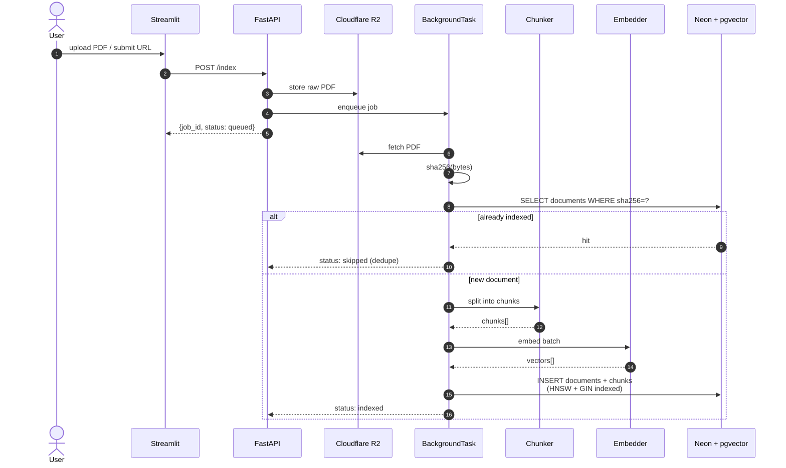

# Architecture

This document describes the production architecture for the AI PDF Assistant. It complements [`plan.md`](./plan.md), which lists the work to get there.

The system is a Retrieval-Augmented Generation (RAG) service: users upload PDFs, the system indexes them into a vector store, and users ask questions answered with citations grounded in the indexed content.

---

## 1. System Architecture (Runtime View)

Shows where each component runs, and the connections between them.



---

## 2. Query Flow (Read Path)

What happens when a user asks a question.



**Notes:**

- Retrieval is hybrid: dense (cosine over pgvector) **plus** sparse (`ts_rank_cd` over a `tsvector` column), fused with Reciprocal Rank Fusion. Pure dense underperforms on proper nouns, IDs, and codes.
- The reranker is a cross-encoder running locally — much higher quality than the dense bi-encoder alone, no API cost.
- The below-threshold short-circuit is important: when retrieval is weak, we **skip the LLM call** and return "I don't know." This prevents hallucinated answers and saves tokens.
- Citations are first-class in the response payload: `{answer, citations: [{doc_id, page, snippet, score}]}`.

---

## 3. Ingestion Flow (Write Path)

What happens when a PDF is added.



**Notes:**

- Ingestion is **idempotent**, keyed on `sha256` of the PDF bytes. Re-submitting the same PDF is a no-op.
- The original PDF is stored in R2 *before* processing begins. This makes R2 the source of truth; if embeddings need to be regenerated (new model, new chunker), we re-ingest from R2 without data loss.
- `/index` returns immediately with a job ID. The actual work runs in a `BackgroundTask` so the API stays responsive. When ingestion volume grows beyond a single VM, this swaps for a real queue (Upstash Redis + RQ) without changing the API surface.

---

## 4. Data Model

Two tables in Neon Postgres.

```
documents
  id                 uuid PK
  sha256             text UNIQUE          -- dedupe key
  source_url         text                 -- original URL or R2 key
  title              text
  pages              int
  embedder_version   text                 -- enables re-embedding migrations
  chunker_version    text
  created_at         timestamptz

chunks
  id                 uuid PK
  doc_id             uuid FK → documents
  page               int
  text               text
  embedding          vector(384)          -- bge-small-en-v1.5
  tsv                tsvector             -- generated from text

indexes
  chunks_embedding_hnsw    HNSW (cosine)
  chunks_tsv_gin           GIN
  documents_sha256_unique  UNIQUE
```

The `embedder_version` and `chunker_version` columns matter: when either changes, we know which rows are stale and can re-embed them incrementally instead of nuking and reloading the whole corpus.

---

## 5. Key Design Choices

### Stateless API
All state lives in Neon (structured + vector data) and R2 (PDF blobs). The Fly.io VM is disposable — restart, scale, or replace freely without coordination.

### Embedder + reranker run in-process
No separate ML service to operate, no API cost, deterministic latency. Trade-off: ~400 MB resident memory, which is why the Fly VM is sized at 512 MB. If the model is upgraded to something larger (e.g., `bge-large`), this assumption is revisited.

### Background ingestion, foreground query
`/index` returns immediately with a job ID; `/query` is synchronous and streams tokens via SSE. This is the right shape for a chat UX: indexing is rare and slow, querying is frequent and latency-sensitive.

### R2 is the source of truth for PDFs
Neon holds *derived* data (chunks + embeddings). Any derived artifact can be rebuilt from R2 — critical for embedding-model migrations and disaster recovery.

### No framework lock-in
We use the `groq` SDK and `sentence-transformers` directly rather than a higher-level RAG framework. The RAG pipeline is small enough (~150 lines) that owning it is cheaper than fighting framework API churn. This was a direct lesson from the legacy `app_api.py`, which had to use regex on error strings to recover from upstream framework changes.

### Observability is built in, not bolted on
Every request gets a Langfuse trace with child spans for `retrieve`, `rerank`, and `generate`. Token counts and latency are captured per span. When a user reports a bad answer, we can replay exactly what context the LLM saw.

### Below-threshold short-circuit
If the best retrieval score is below `MIN_SIMILARITY`, we never call the LLM. This trades a few "I don't know" responses for zero hallucinated answers on out-of-corpus questions.

---

## 6. Out of Scope (for v0.1)

These are real production needs, deferred until justified by traffic or requirements. See [`plan.md`](./plan.md#deferred-do-later-when-justified) for the full list.

- Authentication / multi-tenancy
- Dedicated queue worker (Celery / RQ)
- Semantic answer caching
- PII scanning at ingest
- Output moderation
- Kubernetes
- Re-embedding migration tooling

---

## 7. Free-Tier Budget

| Service | Free-tier limit | What we use it for |
|---|---|---|
| Groq | 30 RPM, ~1M tokens/day | LLM completions + eval judge |
| Neon Postgres | 0.5 GB, 190 compute-hr/mo | `documents`, `chunks`, pgvector |
| Cloudflare R2 | 10 GB, $0 egress | Raw PDF storage |
| Fly.io | 3× shared-cpu-1x 256MB | API runtime (sized to 512 MB) |
| Hugging Face Spaces | Free CPU, sleeps after 48h idle | Streamlit UI |
| Langfuse Cloud | 50k observations/mo free | Tracing (self-hosting deferred — bundles 5 containers, too heavy for an 8 GB dev laptop) |
| Sentry | 5k events/mo | Error tracking |
| GitHub Actions | Free for public repos | CI + image build |

Target monthly cost at v0.1: **$0**.
