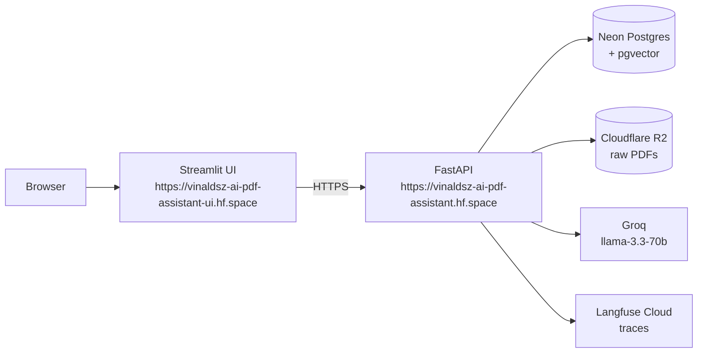

# AI PDF Assistant

A production-grade Retrieval-Augmented Generation (RAG) service deployed entirely on free tiers. Users upload PDFs via URL, the system indexes them into a hybrid vector store, and users ask questions that return grounded answers with page-level citations. The full pipeline — chunking, embedding, retrieval, reranking, and generation — is implemented in approximately 150 lines of explicit Python with no RAG framework.

---

## Architecture



Both the API and the UI are deployed as separate Docker-based HuggingFace Spaces. The API container bakes the local ML models (embedder + reranker) into the image at build time — no model downloads at runtime, no separate ML inference service.

---

## What makes this non-trivial

Most RAG demos use a single PDF, a single embedding call, and a single LLM call. They hallucinate on out-of-corpus questions, have no deduplication, and provide no way to diagnose why an answer was wrong. This project addresses each of those problems explicitly:

**Hybrid retrieval with Reciprocal Rank Fusion.** Dense vector search alone misses exact terms — model names, paper IDs, numeric codes. Combining cosine similarity over pgvector HNSW with sparse `tsvector` full-text search, then fusing the ranked lists with RRF, gives meaningfully better recall than either approach alone.

**Local cross-encoder reranking.** A `bge-reranker-base` model runs in-process to re-score the top-20 candidates. Unlike the bi-encoder used for retrieval, a cross-encoder attends to both query and chunk jointly, producing significantly better relevance scores. No API cost, deterministic latency.

**Hallucination guard via below-threshold short-circuit.** If the best retrieval score is below `MIN_SIMILARITY`, the LLM is never called. The system returns "I don't know" rather than inventing an answer. This is load-bearing: it prevents hallucinations on out-of-corpus questions and conserves Groq quota.

**Idempotent ingestion keyed on SHA-256.** Re-submitting the same PDF is always a no-op. Raw PDFs are stored in Cloudflare R2 as the source of truth; Neon holds only derived data (chunks and embeddings), which can be regenerated from R2 if the embedding model changes.

**Full observability.** Every request gets a Langfuse trace with child spans for `retrieve`, `rerank`, and `generate`. Token counts and latency are captured per span, and a structured JSON logger propagates a request ID through all spans.

---

## Stack

| Layer | Technology | Hosting |
|---|---|---|
| API | FastAPI + uvicorn | HuggingFace Spaces (CPU basic, 2 vCPU, 16 GB RAM) |
| UI | Streamlit | HuggingFace Spaces (CPU basic) |
| Embedder | `BAAI/bge-small-en-v1.5` (local, ~90 MB) | In-process on HF Spaces |
| Reranker | `BAAI/bge-reranker-base` (local, ~570 MB) | In-process on HF Spaces |
| Vector DB | Neon Postgres + pgvector (HNSW cosine + GIN tsvector) | Neon Cloud |
| LLM | Groq `llama-3.3-70b-versatile` (streamed SSE) | Groq Cloud |
| PDF storage | Cloudflare R2 | Cloudflare |
| Observability | Langfuse Cloud (traces) + structlog (JSON logs) | Langfuse Cloud |
| CI | GitHub Actions (lint, typecheck, security scan, tests) | GitHub |
| Package manager | uv | — |

---

## Quick start (local)

Prerequisites: Docker, [uv](https://github.com/astral-sh/uv), a Groq API key.

```bash
# Clone and install
git clone https://github.com/vinaldsz/ai-pdf-assistant
cd ai-pdf-assistant
uv sync

# Start Postgres + pgvector
docker compose up -d

# Create .env
cat > .env <<EOF
GROQ_API_KEY=gsk_...
DATABASE_URL=postgresql://ai:ai@localhost:5433/ai
# Optional — Langfuse tracing
# LANGFUSE_PUBLIC_KEY=pk-lf-...
# LANGFUSE_SECRET_KEY=sk-lf-...
# Optional — Cloudflare R2
# R2_ACCOUNT_ID=...
# R2_ACCESS_KEY_ID=...
# R2_SECRET_ACCESS_KEY=...
# R2_BUCKET_NAME=...
EOF

# Run migrations
uv run alembic upgrade head

# Start the API
uv run uvicorn app.main:app --reload
```

The API is now at `http://localhost:8000`. Interactive docs at `http://localhost:8000/docs`.

Start the UI in a separate terminal:

```bash
uv run streamlit run ui/streamlit_app.py
```

---

## API reference

| Method | Path | Description |
|---|---|---|
| `GET` | `/health` | Liveness check |
| `GET` | `/ready` | Readiness check — DB connectivity and models warm |
| `POST` | `/index` | Submit a PDF URL for background indexing |
| `GET` | `/jobs/{id}` | Poll ingestion job status |
| `POST` | `/query` | Ask a question, returns JSON with answer and citations |
| `POST` | `/query/stream` | Ask a question, streams SSE tokens |

**Index a PDF:**
```bash
curl -X POST http://localhost:8000/index \
  -H "Content-Type: application/json" \
  -d '{"url": "https://arxiv.org/pdf/1706.03762"}'
# {"job_id": "...", "status": "queued"}
```

**Poll job status:**
```bash
curl http://localhost:8000/jobs/<job_id>
# {"status": "done", "chunk_count": 66}
```

**Query (streaming):**
```bash
curl -N -X POST http://localhost:8000/query/stream \
  -H "Content-Type: application/json" \
  -d '{"query": "What is the attention mechanism?"}'
# data: {"token": "The"}
# data: {"token": " attention"}
# ...
# data: {"citations": [...], "done": true}
```

**Query (JSON):**
```bash
curl -X POST http://localhost:8000/query \
  -H "Content-Type: application/json" \
  -d '{"query": "What is the attention mechanism?"}'
# {"answer": "...", "citations": [{"doc_id": "...", "page": 3, "snippet": "...", "score": 0.91}]}
```

---

## Configuration

All settings live in `app/settings.py` (Pydantic `BaseSettings`). Set via `.env` or environment variables. Required variables raise a `ValidationError` at import time if missing.

| Variable | Required | Default | Description |
|---|---|---|---|
| `GROQ_API_KEY` | Yes | — | Groq API key for answer generation |
| `DATABASE_URL` | Yes | — | Postgres connection string |
| `LANGFUSE_PUBLIC_KEY` | No | — | Enables Langfuse tracing |
| `LANGFUSE_SECRET_KEY` | No | — | Enables Langfuse tracing |
| `R2_ACCOUNT_ID` | No | — | Cloudflare R2 account ID |
| `R2_ACCESS_KEY_ID` | No | — | Cloudflare R2 access key |
| `R2_SECRET_ACCESS_KEY` | No | — | Cloudflare R2 secret key |
| `R2_BUCKET_NAME` | No | — | Cloudflare R2 bucket name |
| `OPENROUTER_API_KEY` | No | — | OpenRouter key for eval judge only |
| `EMBEDDING_MODEL` | No | `BAAI/bge-small-en-v1.5` | Sentence-transformers model |
| `RERANKER_MODEL` | No | `BAAI/bge-reranker-base` | Cross-encoder model |
| `LLM_MODEL` | No | `llama-3.3-70b-versatile` | Groq model ID |
| `MIN_SIMILARITY` | No | `0.30` | Below this retrieval score, returns "I don't know" |
| `TOP_K` | No | `20` | Candidates retrieved before reranking |
| `RERANK_K` | No | `5` | Chunks passed to the LLM |
| `CHUNK_SIZE` | No | `800` | Characters per chunk |
| `CHUNK_OVERLAP` | No | `120` | Character overlap between consecutive chunks |

---

## Free-tier budget

| Service | Free-tier limit | Used for |
|---|---|---|
| HuggingFace Spaces | 2 vCPU, 16 GB RAM, sleeps after 48h idle | API container + local ML models; UI container |
| Groq | 30 RPM, ~1M tokens/day | LLM completions |
| Neon Postgres | 0.5 GB, 190 compute-hr/mo | `documents`, `chunks`, pgvector indexes |
| Cloudflare R2 | 10 GB storage, $0 egress | Raw PDF storage |
| Langfuse Cloud | 50k observations/mo | Request tracing |
| GitHub Actions | Free for public repos | CI: lint, typecheck, security scan, tests |

Target monthly cost: **$0**

---

## Deploy to HuggingFace Spaces

The API and UI each live in a separate HF Space backed by a Docker image.

**API Space:**
```bash
# Add the HF remote once
git remote add hf https://huggingface.co/spaces/vinaldsz/ai-pdf-assistant

# Deploy
git push hf main
```

The Space reads secrets from the HF Spaces settings UI (or via the Spaces API). Set `GROQ_API_KEY`, `DATABASE_URL`, and the R2 and Langfuse variables there.

**UI Space** (Streamlit, separate repo/space):
```bash
# Copy UI files to a separate worktree and push
cp -r ui/ /tmp/hf-ui-deploy/
cd /tmp/hf-ui-deploy
git init && git remote add hf https://huggingface.co/spaces/vinaldsz/ai-pdf-assistant-ui
git add . && git commit -m "deploy"
git push hf main --force
```

---

## Development

```bash
# Lint + format
uv run ruff check app/ tests/
uv run ruff format app/ tests/

# Type check
uv run mypy app/

# Run all tests
uv run pytest

# Skip slow (real-model) tests
uv run pytest -m "not slow"

# Run eval harness
uv run python -m eval.run
```

---

## Project structure

```
app/
  ingest/       # PDF download, SSRF guard, chunking, embedding, store
  obs/          # structlog JSON logging + Langfuse tracing
  rag/          # embedder, retriever (hybrid RRF), reranker, generator
  routes/       # FastAPI route handlers
  settings.py   # All config via Pydantic BaseSettings
  main.py       # App factory, middleware, lifespan
ui/
  streamlit_app.py   # Streamlit chat UI (pure HTTP, no app/ imports)
eval/                # Ragas-based evaluation harness
tests/               # pytest unit + integration tests
migrations/          # Alembic schema migrations
legacy/              # Old phidata-based code — reference only, do not import
```
